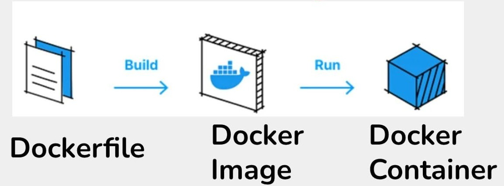
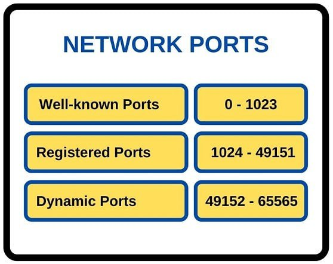
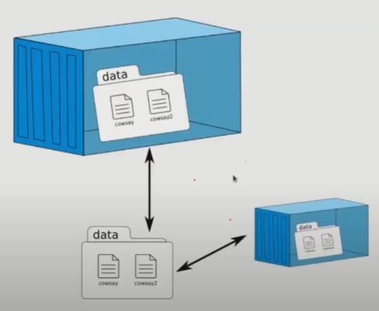

# Docker for Data Science Projects - Workshop Guide

## 1. Docker Concepts

<div align="center">
    
</div>

In simple terms:

- Docker: The most advanced environment manager
- Dockerfile: A recipe for a dish
- Docker Image: A cooked dish
- Docker Compose: Instructions for serving the dish
- Docker Container: A served dish

In technical terms:

### 1.1. Dockerfile

- A file named "Dockerfile" (with capital D) that specifies how the image should be built. For example, it mentions the Python version and states that the list of Python packages is in the requirements.txt file.
- This file is usually placed in the root of our project.

### 1.2. Build Command

- With this command, an image is created based on the instructions written in the Dockerfile.

### 1.3. Docker Image

- The created image is actually a file containing a lightweight Ubuntu Linux with installed packages. For example, a lightweight Python and some Python libraries.
- The created image is like a compressed (zipped) file.
- Therefore, it's easily portable and shareable.
- But it can't be used until it's unpacked.

### 1.4. Run Command

This command creates a container from an image.

- It unpacks the image (which is like a compressed file) to make it usable.
- This command is usually long and complex, and differs for each image. Therefore, it's not easy to memorize.
- docker-compose.yml file: To solve the run command problem, this command is written in a yml file and placed in the root of the image. From now on, the work becomes simple because with a simple command (constant for all images), a container can be started and stopped.
  ```
  docker-compose up --build
  docker-compose down
  ```
- Writing the docker-compose.yml file is practically the hardest part of Docker and has its own specific points for each project. We have prepared this file for everyday data science tasks, which follows. For other projects, such as a website, you need to learn specifically for that task. ChatGPT can also be very helpful.

### 1.5. Docker Container

- A container is a lightweight Ubuntu Linux with installed packages.
- Obviously, a container does not have the ability to be moved and shared, and whenever we make changes to it and want to share it with others, we need to create an image from it again. Then share the resulting image.

### 1.6. Docker Ignore (.dockerignore)

The following questions are covered in order:

- Is a .dockerignore file still needed when there's a .gitignore in the project? Yes
- What's the difference between .dockerignore and .gitignore?
- An appropriate .dockerignore for a data science project.
- Explanation of .dockerignore content.

Let me help you with creating a .dockerignore file. Yes, you should have a .dockerignore file even if you already have a .gitignore. While both files serve similar purposes of excluding files from operations, they have different contexts:

1. .gitignore prevents files from being tracked in Git version control
2. .dockerignore prevents files from being copied into Docker images during the build process

Having a .dockerignore file is important because it:

- Reduces the build context size, making builds faster
- Prevents sensitive information from being copied into your Docker images
- Improves build cache efficiency
- Prevents unnecessary files from bloating your Docker images

A .dockerignore file specifically tailored for Docker builds includes patterns to exclude:

1. Python-specific: Compiled Python files, cache, and build artifacts that shouldn't be in the Docker image
2. Virtual environments: Local virtual environments that shouldn't be copied into the image
3. Development and IDE files: Editor configs and Git-related files that aren't needed in production
4. Docker-specific: Dockerfile, docker-compose files, and .dockerignore itself
5. Build and distribution: Local build artifacts
6. System files: OS-specific files like .DS_Store and Windows Zone identifiers

## 2. Installing Docker

### 2.1. Installing Docker on Ubuntu

You can easily install Docker using the official documentation or with ChatGPT assistance. After installation, verify it's working properly by running Docker commands like `docker images`, `docker ps`, and the hello-world container.

```bash
# Add Docker's official GPG key:
sudo apt-get update
sudo apt-get install ca-certificates curl
sudo install -m 0755 -d /etc/apt/keyrings
sudo curl -fsSL https://download.docker.com/linux/ubuntu/gpg -o /etc/apt/keyrings/docker.asc
sudo chmod a+r /etc/apt/keyrings/docker.asc

# Add the repository to Apt sources:
echo \
  "deb [arch=$(dpkg --print-architecture) signed-by=/etc/apt/keyrings/docker.asc] https://download.docker.com/linux/ubuntu \
  $(. /etc/os-release && echo "$VERSION_CODENAME") stable" | \
  sudo tee /etc/apt/sources.list.d/docker.list > /dev/null
sudo apt-get update

# Install Docker and Docker Compose
sudo apt-get install docker-ce docker-ce-cli containerd.io docker-buildx-plugin docker-compose-plugin

# Install the latest Docker Compose
sudo curl -L "https://github.com/docker/compose/releases/latest/download/docker-compose-$(uname -s)-$(uname -m)" -o /usr/local/bin/docker-compose

sudo chmod +x /usr/local/bin/docker-compose
```

### 2.2. Installing Docker on Windows

There's nothing special about this process. Simply download and install the 64-bit version of Docker Desktop for Windows.

**Note**: To connect VS Code to Docker, Docker must be installed on Windows itself; installing it in WSL is not sufficient.

### 2.3. After Installing Docker

After installation, verify Docker is working correctly:

```bash
docker --version
sudo systemctl enable docker
sudo service docker start
```

**Note for WSL users**: 
WSL does not use systemd, so `systemctl` commands don't work inside WSL. In WSL, you'll need to run `sudo service docker start` each time you boot your laptop. You can automate this with a script or alias.

```bash
# Check Docker installation
sudo docker images
sudo docker ps
```

To use Docker without `sudo`:

```bash
sudo usermod -aG docker $USER
```

Test it:

```bash
docker images
docker ps
```

### 2.4. Automating Docker Startup in WSL

In WSL, the `sudo systemctl enable docker` command doesn't work because WSL doesn't use systemd. Here are options to start Docker automatically:

#### Option 1: Manual
If you're okay with typing a command daily, just stick with:
```bash
sudo service docker start
```

#### Option 2: Using an alias
Create an alias to shorten the command:
```bash
echo 'alias start-docker="sudo service docker start"' >> ~/.bashrc
source ~/.bashrc
```
Now, you can just type:
```bash
start-docker
```

#### Option 3: Automatic
To start Docker automatically when you open WSL:

1. Open WSL and edit the WSL configuration file:
   ```bash
   sudo nano /etc/wsl.conf
   ```

2. Add the following lines:
   ```
   [boot]
   command="service docker start"
   ```

3. Save the file (Ctrl + X, then Y, then Enter).

4. Restart WSL:   
   ```bash
   wsl --shutdown
   ```

## 3. Setting Up Docker for a Data Science Project

Docker Project Setup for Python and Jupyter Notebooks
This guide creates a portable and reproducible Docker project template that lets you develop Python scripts and Jupyter notebooks using VS Code in a containerized environment.

### 3.1. Step 1: Install Prerequisites

- Install Docker Desktop with WSL integration on Windows 11.
- Install Visual Studio Code.
- In VS Code, install these extensions: Docker, Remote - Containers, Python, and Jupyter.

### 3.2. Step 2: Set Up Your Project Repository

- Create a new Git repository (or clone an existing one).
- In the repository folder, create these files:
  - Dockerfile
  - .dockerignore
  - docker-compose.yml
  - requirements.txt
  - aaa.py
  - bbb.ipynb

### 3.3. Step 3: Write the Dockerfile

Place the following content in your Dockerfile:

```
# Base image with Python 3.9
FROM python:3.9

# Set the working directory
WORKDIR /app

# Copy requirements and install dependencies
COPY requirements.txt .
RUN pip install --no-cache-dir -r requirements.txt

# Install Jupyter Notebook and JupyterLab
RUN pip install notebook jupyterlab

# Expose port 8888 for Jupyter
EXPOSE 8888

# Start Jupyter Notebook with no token for development
ENTRYPOINT ["sh", "-c", "exec jupyter notebook --ip=0.0.0.0 --port=8888 --no-browser --allow-root --NotebookApp.token=''"]
```

### 3.4. Step 4: Write the .dockerignore file

Create a .dockerignore file in your project root to prevent unnecessary files from being included in your Docker image.

### 3.5. Step 5: Write the Docker Compose File

In docker-compose.yml, add:

```
services:
  your-project:
    build: .
    image: your-project_image
    container_name: your-project_container
    volumes:
      - .:/app
    stdin_open: true
    tty: true
    ports:
      - "8888:8888"
```

This mounts your entire project folder into the container at /app.
Note:
In lines 2, 3, and 4, replace your-project with your project's name, for example: dockerproject1.

### 3.6. Step 6: requirements.txt

Ensure the project has a ***clean*** requirements.txt file ***like this***:

```
numpy==1.26.0
pandas==2.1.3
matplotlib==3.8.0
```

Best Practice:
Use pip in Docker unless Conda is essential.
Stick to requirements.txt for best compatibility and performance.

### 3.7. Step 7: Build and Run Your Container

On your host machine (in the project folder), run:

```
docker-compose up --build -d
```

This builds the container using the Dockerfile and starts it in detached mode.
Note: We could omit "--build", but then changes to Dockerfile or dependencies would not be applied.

### 3.8. Step 8: Verify the Container

Run:

```
docker-compose ps
```

Make sure the container status is "Up" and port 8888 is mapped.

### 3.9. Step 9: Attach VS Code to the Container

- Open VS Code and press Ctrl+Shift+P.
- Select "Dev Containers: Attach to Running Container…".
- Choose the container named "your-project_container".  A new VS Code window will be opened.
- In VS Code, press open folder. Then, in the top box, you will see /root. Delete root to see app. Finally, you will see all your project files, including aaa.py and bbb.ipynb.

### 3.10. Step 10: Run the Python Script

In the VS Code terminal (inside the container), run:

```
python aaa.py
```

You should see the expected output (for example, "hi").

### 3.11. Step 11: Work with Jupyter Notebooks in VS Code

- Open bbb.ipynb in VS Code.
- In VS Code, install the following extensions: Docker, Dev Containers, Python, Jupyter.
- VS Code will prompt you to select a kernel. Choose the Python kernel that is specified in the Dockerfile. The Libraries that have been listed in the requirements.txt and installed in the docker will be run automatically.
- Now you can run and edit cells directly in VS Code.

### 3.12. Step 12: Stop and remove the container

```
docker-compose down
```

### 3.13. Note 1: Jupyter on browser

See localhost:8888/tree?

### 3.14. Note2: Keeping Your Environment Up-to-Date

- To rebuild your container with any changes, run on your host:

  ```
  docker-compose up --build
  ```
- After installing a new package, update requirements.txt inside the container by running:

  ```
  pip freeze > requirements.txt
  ```
- For pulling the latest base image, run:

  ```
  docker-compose build --pull
  ```

## 4. Essential Docker Commands

### 4.1. Managing Images

```
# Pull images from Docker Hub
docker pull nginx
docker pull hello-world

# List all images
docker images

# Remove images
docker rmi <image1> <image2> ...
```

### 4.2. Managing Containers

```
# List running containers
docker ps

# List all containers (including stopped ones)
docker ps -a

# List only container IDs
docker ps -aq

# Remove containers
docker rm <CONTAINER1> <CONTAINER2> ...

# Remove all containers
docker rm $(docker ps -aq)

# Run a container in detached mode
docker run -d <IMAGE name or ID>

# Start/stop containers
docker start <CONTAINER name or ID>
docker stop <CONTAINER name or ID>

# Start/stop all containers at once
docker start $(docker ps -aq)
docker stop $(docker ps -aq)
```

**Note**: You can use just the first two letters of a container ID for identification. For example: `docker stop 2f`

### 4.3. Port Mapping Commands

```
# Run nginx and map port 80 of the host to port 80 of the container
docker run -d -p 80:80 nginx

# Run another nginx instance on a different host port
docker run -d -p 8080:80 nginx

# Map multiple ports
docker run -d -p 80:80 -p 443:443 nginx

# Map all exposed ports to random ports
docker run -d -P nginx
```

The `-p host_port:container_port` option maps ports between your host system and the container.

### 4.4. Working with Containers

```
# Enter a container's bash shell
docker exec -it <CONTAINER name or ID> bash

# Save an image to a tar file
docker save -o /home/mostafa/docker-projects/nginx.tar nginx

# Load an image from a tar file
docker load -i /home/mostafa/docker-projects/nginx.tar
```

### 4.5. Custom Container Names

Docker assigns random names to containers by default. To specify a custom name:

```
docker run -d --name <arbitrary-name> -p 80:80 <image-name>
```

Example:
```
docker run -d --name webserver -p 80:80 nginx
```

## 5. Advanced Topics and FAQ

### 5.1. Understanding Network Ports

<div align="center">
    
</div>

In networking:
- IP address identifies which device you're communicating with ("who")
- Port number specifies which service or application on that device ("what")

For example, when you access: `google.com => 215.114.85.17:80`
- `215.114.85.17` is Google's IP address (who you're talking to)
- `80` is the port number for HTTP (what service you're requesting)

Ports can range from `0` to `65,535` (2^16 - 1), with standard services typically using well-known ports:

- Web servers:
  - HTTP: port `80`
  - HTTPS: port `443`

- Development servers:
  - FastAPI: port `8000`
  - Jupyter: port `8888`
  - SSH: port `22`

- Database Management Systems (DBMS):
  - MySQL: port `3306`
  - PostgreSQL: port `5432`
  - MongoDB: port `27017`

**Important Notes on Database Ports:**
- Databases themselves don't have ports; the Database Management Systems (DBMS) do.
- All databases within a single DBMS instance typically use the same port.
- If you want to run two versions of the same DBMS on one server, you must use different ports.
- Exception: Some DBMS like MongoDB allow each database to run on a different port, but by default, all databases share a common port.

### 5.2. Docker Port Mapping in Detail

The port mapping in Docker (`-p 80:80`) allows you to:
1. Access containerized services from your host machine
2. Run multiple instances of the same service on different host ports
3. Avoid port conflicts when multiple containers need the same internal port

With these commands:
- First container: access via `localhost:80` in browser
- Second container: access via `localhost:8080` in browser
- Both containers are running nginx on their internal port `80`

This approach is especially useful for data science projects when you need to:
- Run multiple Jupyter servers
- Access databases from both containerized applications and host tools
- Expose machine learning model APIs

### 5.3. Common Issues and Solutions

#### Container Won't Start
If your container won't start, check:
- Port conflicts: Is another service using the same port?
- Resource limitations: Do you have enough memory/CPU?
- Permission issues: Are volume mounts correctly configured?

#### File Permissions Issues
When using volume mounts, file permission issues can occur. Solutions:
- Use the `--user` flag when running the container
- Set appropriate permissions in the Dockerfile
- Use Docker Compose's `user` option

#### Performance Considerations
- Use `.dockerignore` to reduce build context size
- Minimize the number of layers in your Dockerfile
- Consider multi-stage builds for smaller images

### 5.4. Data Science Specific Considerations

#### Jupyter Notebook Security
For production:
- Don't use `--NotebookApp.token=''`
- Set up proper authentication
- Use HTTPS for connections

#### GPU Support
For deep learning:
- Install NVIDIA Container Toolkit
- Use the `--gpus all` flag with docker run
- Use appropriate base images (e.g., tensorflow/tensorflow:latest-gpu)

#### Large Data Files
When working with large datasets:
- Don't include data in the Docker image
- Use volume mounts for data directories
- Consider using data volumes or bind mounts

### 5.5. Docker Shortcuts (alias)

Add these aliases to your `.bashrc` or `.zshrc` file to make Docker commands more convenient:

```bash
# -- Image Management --
alias di="    docker images --format 'table {{.ID}}\t{{.Repository}}\t{{.Tag}}\t{{.Size}}\t{{.CreatedSince}}'"
alias drmi="  docker rmi"
alias drmia=" docker rmi   $(docker images -aq)"    # Remove all images
alias drmif=" docker rmi   $(docker images -q -f dangling=true)"  # Remove dangling images

# -- Container Management --
alias dps="   docker ps     --format 'table {{.ID}}\t{{.Image}}\t{{.Names}}\t{{.Status}}\t{{.Ports}}'"
alias dpsa="  docker ps -a  --format 'table {{.ID}}\t{{.Image}}\t{{.Names}}\t{{.Status}}\t{{.Ports}}'"
alias dpsaq=" docker ps -aq --format 'table {{.ID}}\t{{.Image}}\t{{.Names}}\t{{.Status}}\t{{.Ports}}'"
alias dst="   docker start"
alias dsta="  docker start $(docker ps -aq)"
alias dsp="   docker stop"
alias dspa="  docker stop  $(docker ps -aq)"
alias drm="   docker rm"
alias drma="  docker rm    $(docker ps -aq)"

# -- Docker Compose Commands --
alias dcu="   docker compose up   -d --build"
alias dcd="   docker compose down"
```

These shortcuts provide:

#### Better Formatted Output
- `di`: Lists images with formatted output showing ID, repository, tag, size, and age
- `dps`/`dpsa`: Shows running/all containers with formatted output

#### Bulk Operations
- `drmia`: Removes all images
- `drmif`: Removes only "dangling" images (untagged images)
- `dsta`/`dspa`: Starts/stops all containers
- `drma`: Removes all containers

#### Shorter Commands
- `dst`/`dsp`: Quick container start/stop
- `dcu`/`dcd`: Docker compose up/down with build and detached mode

To use these aliases:
1. Add the code block to your shell profile file (~/.bashrc or ~/.zshrc)
2. Run `source ~/.bashrc` or `source ~/.zshrc` to apply changes
3. Start using the shortened commands

### 5.6. Understanding and Cleaning Dangling Images

When you run `docker images`, you might see several entries with `<none>` as their repository and tag:

```
REPOSITORY                                 TAG     IMAGE ID       CREATED        SIZE
p1-ml-engineering-api-fastapi-docker-jupyter  latest  5afe18f4594a  13 hours ago   745MB
<none>                                     <none>  808f843b9362  13 hours ago   748MB
<none>                                     <none>  5706fd96eca0  14 hours ago   742MB
<none>                                     <none>  1e904ba38c6d  14 hours ago   742MB
```

#### What are these `<none>` images?

These are called "dangling images" and they typically appear in these scenarios:

- When you rebuild an image with the same tag - the old image becomes "dangling" and shows up as `<none>:<none>`
- When a build fails or is interrupted in the middle
- When you pull a new version of an image, and the old one loses its tag

#### Why should you care?

Dangling images:
- Take up disk space unnecessarily
- Make your image list harder to read
- Serve no practical purpose

#### How to remove dangling images:

You can safely remove all dangling images using:

```bash
docker image prune -f
```

Or use the alias we defined earlier:

```bash
drmif
```

After running this command, you'll see output listing all the deleted images:

```
Deleted Images:
deleted: sha256:1e904ba38c6dabb0c8c9dd896954c07b5f1b1cf196364ff1de5da46d18aa9fb
deleted: sha256:c73b8c1cc3550886ac1cc5965f89c6c2553b08fb0c472e1a1f9106b26ee4b14
...
```

This helps keep your Docker environment clean and efficient.

### 5.7. Tagging Docker Images

Properly tagging Docker images is essential for organizing, versioning, and deploying your containerized applications, especially in data science projects where model versions are important.

#### Best Practices for Tagging Images

- Use semantic versioning (e.g., `v1.0.1`, `v2.1`)
- Avoid relying on `latest` in production environments
- Use environment-specific tags (`dev`, `staging`, `prod`)
- Tag images before pushing to a registry

#### Basic Tagging Command

To tag a Docker image, use the following syntax:

```bash
docker tag SOURCE_IMAGE[:TAG] TARGET_IMAGE[:TAG]
```

#### Examples

**Simple version tagging:**
```bash
# Tag the current 'latest' image with a version number
docker tag my-datascience-app:latest my-datascience-app:v1.0
```

**Preparing for Docker Hub:**
```bash
# Tag for pushing to Docker Hub
docker tag my-datascience-app:latest username/my-datascience-app:v1.0

# Then push to Docker Hub
docker push username/my-datascience-app:v1.0
```

**Multiple tags for different environments:**
```bash
# Create production-ready tag
docker tag my-ml-model:v1.2.3 my-ml-model:prod

# Create development tag
docker tag my-ml-model:latest my-ml-model:dev
```

#### For Data Science Projects

For data science projects, consider including model information in your tags:

```bash
# Include model architecture and training data version
docker tag my-model:latest my-model:lstm-v2-dataset20230512

# Include accuracy metrics
docker tag my-model:latest my-model:v1.2-acc95.4
```

Proper tagging helps you maintain reproducibility and track which model version is deployed where.

### 5.8. Working with Docker Volumes

By default, when a container is stopped or removed, all data inside it is lost. Docker volumes solve this problem by providing persistent storage that exists outside of containers.

<div align="center">
    
</div>

#### Why Use Volumes?

- **Data Persistence**: Keep data even when containers are removed
- **Data Sharing**: Share data between multiple containers
- **Performance**: Better I/O performance than bind mounts, especially on Windows/Mac
- **Isolation**: Manage container data separately from host filesystem

#### Basic Volume Usage

**Syntax for mounting volumes:**
```bash
docker run -v /host/path:/container/path[:options] image_name
```

#### Examples

**Example 1: Exploring a Container's Default Storage**

First, let's see what's inside a container without volumes:
```bash
# Start an nginx container
docker run -d --name nginx-test -p 80:80 nginx

# Enter the container
docker exec -it nginx-test bash

# Check the content of nginx's web directory
cd /usr/share/nginx/html
ls -la
```

**Example 2: Using a Volume for Persistence**

Now let's mount a local directory to nginx's web directory:
```bash
docker run -d -p 3000:80 -v /home/username/projects/my-website:/usr/share/nginx/html nginx
```

This mounts your local directory `/home/username/projects/my-website` to the container's `/usr/share/nginx/html` directory. Any changes in either location will be reflected in the other.

#### Security Considerations

The previous example gives full read/write access to the container. For better security, add the `:ro` (read-only) option:

```bash
docker run -d -p 3000:80 -v /home/username/projects/my-website:/usr/share/nginx/html:ro nginx
```

This prevents the container from modifying files in your local directory.

#### Volumes in Data Science Projects

For data science projects, volumes are particularly useful for:

**Persisting Jupyter notebooks and data:**
```bash
docker run -d -p 8888:8888 -v /home/username/ds-project:/app jupyter/datascience-notebook
```

**Sharing datasets between containers:**
```bash
# Create a named volume
docker volume create dataset-vol

# Mount the volume to multiple containers
docker run -d --name training -v dataset-vol:/data training-image
docker run -d --name inference -v dataset-vol:/data inference-image
```

**Storing model artifacts:**
```bash
docker run -d -p 8501:8501 -v /home/username/models:/models -e MODEL_PATH=/models/my_model ml-serving-image
```

#### Volume Types in Docker

1. **Named Volumes** (managed by Docker):
   ```bash
   docker volume create my-volume
   docker run -v my-volume:/container/path image_name
   ```

2. **Bind Mounts** (direct mapping to host):
   ```bash
   docker run -v /absolute/host/path:/container/path image_name
   ```

3. **Tmpfs Mounts** (stored in host memory):
   ```bash
   docker run --tmpfs /container/path image_name
   ```

Volumes are essential for any data science workflow, ensuring your data, code, and models persist beyond the container lifecycle.

### 5.9. Frequently Asked Questions (FAQ)

#### Q1: Comparing Environment Managers: venv vs. Conda vs. Docker

<div align="center">
    
</div>

Each environment management tool serves different needs and complexity levels:

**Python venv**:
- **What**: Lightweight built-in Python tool for isolated environments
- **Best for**: Simple Python projects with minimal dependencies
- **Pros**: Easy to use, minimal overhead, standard Python tool
- **Cons**: Only handles Python packages, no system-level isolation

**Conda**:
- **What**: Cross-platform package and environment manager
- **Best for**: Data science projects with complex dependencies across languages
- **Pros**: Manages both Python and non-Python packages (e.g., C libraries)
- **Cons**: Heavier than venv, slower package resolution

**Docker**:
- **What**: Complete containerization platform with full system isolation
- **Best for**: Production deployments, ensuring consistency across environments
- **Pros**: Full isolation including OS, reproducible environments, scalable
- **Cons**: Steeper learning curve, more resource-intensive

**When to choose Docker for data science**:
- Working in teams with different operating systems
- Projects requiring specific system configurations
- Deploying models to production
- Projects needing exact reproducibility long-term

#### Q2: Project Setup Order: Repository Clone vs. Environment Creation

**Recommended Workflow**:

1. **First**: Clone the repository
   ```bash
   git clone https://github.com/username/project.git
   cd project
   ```

2. **Second**: Create your environment
   ```bash
   # For Docker
   docker-compose up -d --build
   
   # For venv
   python -m venv .venv
   source .venv/bin/activate  # On Windows: .venv\Scripts\activate
   pip install -r requirements.txt
   ```

**Why this order works best**:
- The repository often contains environment configuration files
- Environment setup instructions are typically in the README
- Environment files like `requirements.txt` or `Dockerfile` come from the repo

#### Q3: Choosing Python and Library Versions for Data Science Projects

When starting a new data science project, version selection can be challenging. A practical approach is to use versions from Google Colab, which maintains stable, compatible combinations of libraries.

**Steps to check Colab versions**:
```python
# In a Colab notebook
!pip list | grep -E 'pandas|numpy|scikit-learn|matplotlib|tensorflow'
```

**Current recommended versions** (as of 2024):
```
numpy                              2.0.2
pandas                             2.2.2
scikit-learn                       1.6.1
matplotlib                         3.10.0
tensorflow                         2.18.0
scipy                              1.14.1
seaborn                            0.13.2
requests                           2.32.3
```

**Best practices**:
- Pin exact versions in requirements.txt: `numpy==2.0.2`
- Consider compatibility more important than having the latest version
- Test thoroughly when upgrading major versions

#### Q4: Files for Project Reproducibility in Different Environments

Each environment manager requires specific configuration files:

**venv (Python Virtual Environment)**:
- `requirements.txt`: Lists Python package dependencies
  ```
  numpy==2.0.2
  pandas==2.2.2
  scikit-learn==1.6.1
  ```

**Conda**:
- `environment.yml`: Defines Conda environment with all dependencies
  ```yaml
  name: myproject
  channels:
    - conda-forge
    - defaults
  dependencies:
    - python=3.9
    - numpy=2.0.2
    - pandas=2.2.2
  ```
- `requirements.txt`: Often used alongside environment.yml

**Docker**:
- `Dockerfile`: Defines the container image
- `docker-compose.yml`: Configures services, networks, volumes
- `requirements.txt`: Lists Python packages to install in the container

**Multi-environment projects**:
For projects that might use different environments, include configuration files for all potential methods to improve flexibility and adoption.

#### Q5: When to Update requirements.txt

Update your `requirements.txt` file:

1. **After installing new packages**: Immediately capture the new dependency
   ```bash
   pip install new-package
   pip freeze > requirements.txt
   ```

2. **Before committing significant changes**: Ensure environment reproducibility

3. **When upgrading dependency versions**: Document the change

4. **When removing unused packages**: Clean up dependencies

**Inside Docker containers**:
After installing new packages in a running container, update requirements.txt before rebuilding:
```bash
# Inside the container
pip install new-package
pip freeze > requirements.txt

# On host
docker-compose up --build -d
```

**Best practice**: Include the requirement update step in your development workflow documentation to maintain consistent environments across the team.
